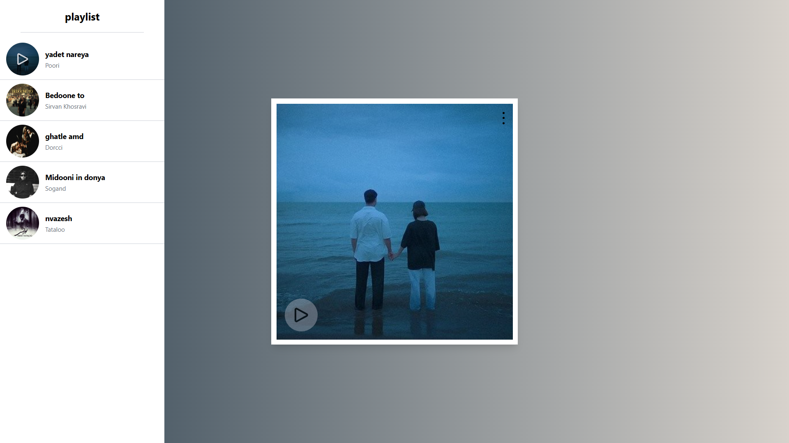

# music player app with playlist

## Project Overview

## Project Description

This project is a music player app with playlist. It allows users to play music, The app uses a database to store music files and playlist information, and provides a user-friendly interface for users to interact with the app. also you can see [this Demo](https://amiraeone.github.io/music-player/) online

## Features

- Shuffle playlist
- repeat playlist

## Future Features

- responsive design
- Play music files from a local directory
- Create and manage playlists
- Add and remove songs from playlists

## Technologies Used

- vanila javascript
- tailwind css
